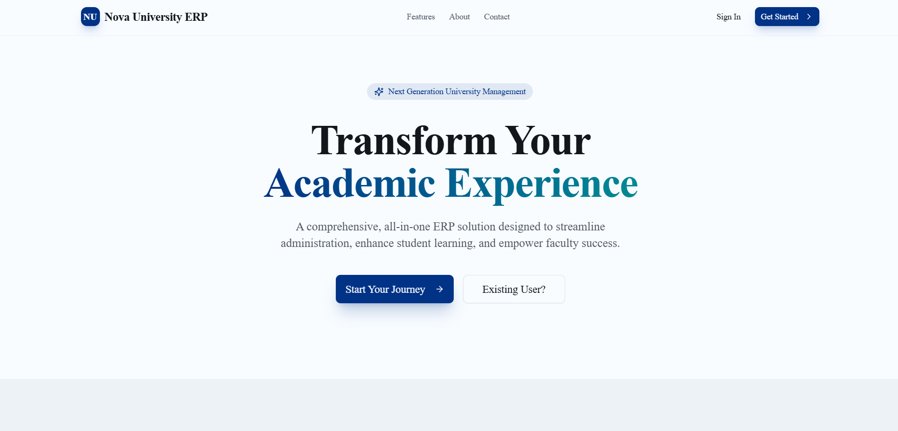
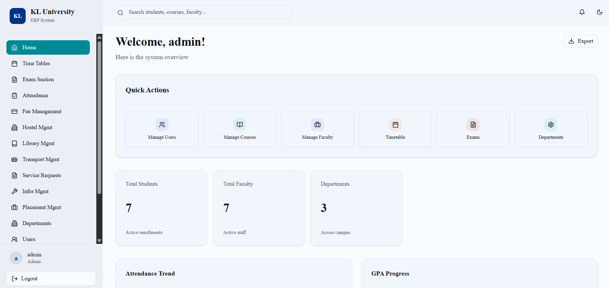

# 🎓 Nova University ERP

<p align="center">
  
</p>


<p align="center">
  <b>Next-Generation University Management System</b><br/>
  A modern ERP platform built to digitize and automate academic institutions.
</p>

<p align="center">
  🌐 <a href="https://nova-university-erp.vercel.app/" target="_blank"><b>Live Website</b></a>
</p>

---

## 🚀 Overview

**Nova University ERP** is a full-stack, production-ready Enterprise Resource Planning system designed for universities and colleges.  
It centralizes academics, administration, finance, and campus operations into one secure and scalable platform.

---

## ✨ Key Features

### 👨‍🎓 Students
- Attendance, grades, CGPA dashboard
- Course registration and timetable
- Fee payments and transaction history
- Hostel allocation and transport services
- Library access and digital documents

### 👩‍🏫 Faculty
- Digital attendance marking
- Course and timetable management
- Marks entry and grading automation
- Upload notes, assignments, and exams

### 🏛️ Administration
- Role-based access control (Admin, Faculty, Student, Parent)
- Academic and financial analytics
- Department, faculty, and student management
- Hostel, transport, inventory, and complaints modules
- System-wide notifications and settings

---

## 🛠️ Tech Stack

<p align="center">
  
</p>

| Layer | Technology |
|------|-----------|
| Frontend | Next.js (App Router), React, Tailwind CSS |
| Backend | Next.js API Routes, Server Actions |
| Database | PostgreSQL |
| Authentication | Custom RBAC + JWT |
| UI | ShadCN UI, Radix UI, Lucide Icons |
| Deployment | Vercel |
| Database Hosting | Supabase |

---

## 🖼️ Screenshots

### 🏠 Main Page
<p align="center">
  
</p>

### 🛠️ Admin Dashboard
<p align="center">
  
</p>

---

## ⚙️ Getting Started

### Prerequisites
- Node.js 18+
- PostgreSQL

### Installation

```bash
git clone https://github.com/kh-bikash/nova-university-erp.git
cd nova-university-erp
npm install
