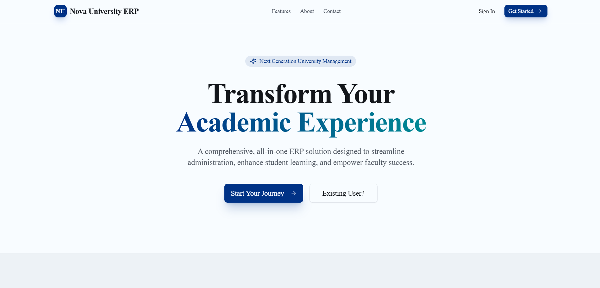
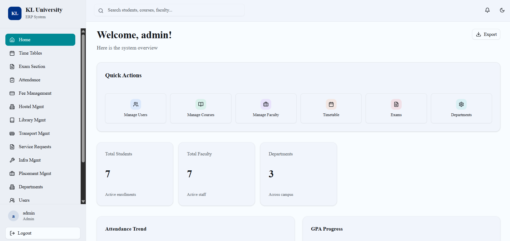

<div align="center">

# 🎓 Nova University ERP

**Next-Generation University Management System**

A modern, fast, and scalable ERP platform built to digitize and automate academic institutions.

[](https://nextjs.org/)
[](https://reactjs.org/)
[](https://www.typescriptlang.org/)
[](https://tailwindcss.com/)
[](https://www.postgresql.org/)

🌐 [**Live Demo**](https://nova-university-erp.vercel.app/) • 📚 [**Documentation**](#-getting-started) • 🚀 [**Deploy**](#-deployment)


</div>

---

## 🚀 Overview

**Nova University ERP** is a full-stack, production-ready Enterprise Resource Planning system designed specifically for universities and colleges. It brings all academic, administrative, financial, and campus operations into a single, unified, and highly secure platform. 

Built with the latest web technologies, it offers a blazing-fast user experience and a beautiful, intuitive interface.

---

## ✨ Key Features

### 👨‍🎓 For Students
- **Dashboard**: Real-time attendance, grades, and CGPA tracking.
- **Academics**: Course registration, automated timetables, and resource access.
- **Finances**: Fee payments, invoicing, and detailed transaction history.
- **Campus Life**: Hostel allocation, transport services, and library access.

### 👩‍🏫 For Faculty
- **Classroom**: Digital attendance marking and interactive class management.
- **Academics**: Course scheduling and comprehensive timetable overview.
- **Evaluation**: Marks entry, grading automation, and performance analytics.
- **Resources**: Upload notes, assignments, quizzes, and exams seamlessly.

### 🏛️ For Administration
- **Security**: Robust Role-Based Access Control (Admin, Faculty, Student, Parent).
- **Analytics**: Deep academic and financial insights with visual dashboards.
- **Management**: Streamlined department, faculty, and student onboarding.
- **Operations**: Hostel, transport, inventory, and complaints modules.
- **Communication**: System-wide announcements, notifications, and settings.

---

## 🛠️ Technology Stack

| Layer | Technology |
|-------|------------|
| **Frontend** | Next.js 14 (App Router), React 18, Tailwind CSS |
| **Backend** | Next.js API Routes, Server Actions, Node.js |
| **Database** | PostgreSQL, Neon (Hosting) |
| **Auth** | Custom RBAC, JWT (JSON Web Tokens) |
| **Caching/Queue**| Redis (Upstash), BullMQ |
| **UI Components**| ShadCN UI, Radix UI, Lucide Icons, Framer Motion |
| **Deployment** | Vercel |

---

## 🖼️ Gallery

<div align="center">
  
  <i>The unified student dashboard showing analytics and quick actions.</i>
</div>

<br/>

<div align="center">
  
  <i>Comprehensive administrative controls and system-wide settings.</i>
</div>

---

## ⚙️ Getting Started

Follow these instructions to get the project up and running on your local machine.

### Prerequisites
- [Node.js](https://nodejs.org/) (v18 or higher)
- [PostgreSQL](https://www.postgresql.org/) database (Local or hosted like [Neon](https://neon.tech/))
- [Redis](https://redis.io/) instance (Local or hosted like [Upstash](https://upstash.com/))

### Installation

1. **Clone the repository**
   ```bash
   git clone https://github.com/kh-bikash/nova-university-erp.git
   cd nova-university-erp
   ```

2. **Install dependencies**
   ```bash
   npm install
   ```

3. **Configure Environment Variables**
   Copy the example environment file and fill in your details:
   ```bash
   cp .env.example .env
   ```
   > 💡 *Make sure to set `DATABASE_URL` and `REDIS_URL` correctly.*

4. **Initialize the Database**
   Run the migration script to create the necessary tables:
   ```bash
   npm run migrate
   ```
   *(Alternatively, run the SQL script manually: `psql "${env:DATABASE_URL}" -f scripts/01-create-tables.sql`)*

5. **Start the Development Server**
   ```bash
   npm run dev
   ```

Your app should now be running on [http://localhost:3000](http://localhost:3000).

---

## 🗄️ Background Workers

This project uses BullMQ for background task processing (e.g., automated attendance compilation, notification dispatching).

To start the worker in development:
```bash
npm run worker:attendance
```

---

## 🤝 Contributing

Contributions are welcome! Please feel free to submit a Pull Request.

1. Fork the Project
2. Create your Feature Branch (`git checkout -b feature/AmazingFeature`)
3. Commit your Changes (`git commit -m 'Add some AmazingFeature'`)
4. Push to the Branch (`git push origin feature/AmazingFeature`)
5. Open a Pull Request

---

## 📄 License

Distributed under the MIT License. See `LICENSE` for more information.

<p align="center">
  Made with ❤️ by <a href="https://github.com/kh-bikash">Bikash</a>
</p>
