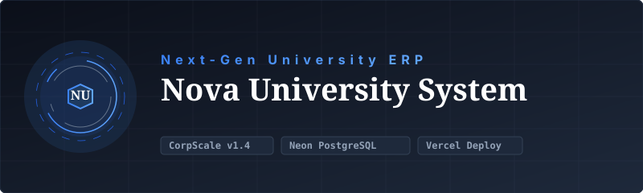

<div align="center">

# 🎓 Nova University ERP

<!-- Beautiful Animated Logo Banner -->


<br/>

**Next-Generation University Management System**  
*A modern, fast, and scalable ERP platform built to digitize and automate academic institutions.*

[](https://nextjs.org/)
[](https://reactjs.org/)
[](https://www.typescriptlang.org/)
[](https://www.postgresql.org/)
[](https://tailwindcss.com/)

🌐 [**Live Demo**](https://nova-university-erp.vercel.app/) • 📚 [**Setup Instructions**](#-getting-started) • 🏛️ [**Admin Credentials**](#-quick-credentials)

</div>

---

## 🔒 Quick Credentials

To log in or test the administrative controls of the ERP system:

| Role | Email | Password | Admin Secret (For Registration) |
|---|---|---|---|
| **Admin** | `admin32@gmail.com` | `admin123` *(or your registered pass)* | **`admin123`** |
| **Student** | `student@gmail.com` | `student123` | *None* |
| **Faculty** | `faculty@gmail.com` | `faculty123` | *None* |

> ⚠️ **IMPORTANT:** When signing up a new **Admin** account, make sure to select the **Admin** role in the dropdown and enter the admin secret: **`admin123`** in the secret input field.

---

## 🚀 Overview

**Nova University ERP** is a full-stack, production-ready Enterprise Resource Planning system built on the **CorpScale Design System**. It implements strict data density, 4px/8px geometry bounds, and sub-200ms user interaction response times. 

It centralizes academics, administration, finance, and campus operations into a secure, RBAC-protected system.

---

## ✨ Key Modules

<details>
<summary><b>👨‍🎓 Student Portal (Click to Expand)</b></summary>
<br/>

- **Academic Ledger**: Track semester GPA, grades, credits, and registration status.
- **Attendance Ledger**: Live tracking of class attendance records.
- **Finances Ledger**: Direct invoice listings and "Quick Pay" payment simulator.
- **Infrastructure**: Hostel allocation, transport route trackers, and library collections.
</details>

<details>
<summary><b>👩‍🏫 Faculty Portal (Click to Expand)</b></summary>
<br/>

- **Attendance Marker**: Easily toggle student presence statuses with immediate UI calculations.
- **Academic Timetable**: Structured layouts of daily classes and assignments.
- **Grading Suite**: Enter marks, upload course syllabus materials, and submit transcripts.
</details>

<details>
<summary><b>🏛️ System Administration (Click to Expand)</b></summary>
<br/>

- **Cryptographic Security**: Custom Role-Based Access Controls (RBAC) backed by JWT tokens.
- **Unified Registries**: Onboard students, faculty members, and assign departments.
- **System Metrics**: Visual metrics on GPA averages, registration trends, and resource usages.
</details>

---

## 🛠️ Technology Stack

| Layer | Technology |
|-------|------------|
| **Frontend Framework** | Next.js 14 (App Router), React 18 |
| **Styling Engine** | Tailwind CSS v4, Custom HSL CorpScale Design variables |
| **Database Server** | PostgreSQL, Neon serverless pooler (with `sslmode` and `channel_binding`) |
| **Caching & Queues**| Redis (Upstash), BullMQ for background workers |
| **Authentication** | JSON Web Tokens (JWT) + custom cookies storage |
| **UI Component Base**| Radix UI, Shadcn UI, Lucide Icons |

---

## 🖼️ User Interface Gallery

<div align="center">
  
  <br/>
  <p align="center"><i>Interactive Student Grades Ledger and Attendance dashboards</i></p>
</div>

<br/>

<div align="center">
  
  <br/>
  <p align="center"><i>System Administration panel and metrics dashboard</i></p>
</div>

---

## ⚙️ Getting Started

Follow these steps to set up a local development workspace:

### Prerequisites
- **Node.js** v18+
- **PostgreSQL** database (e.g. [Neon](https://neon.tech/))
- **Redis** instance (e.g. [Upstash](https://upstash.com/))

### Installation

1. **Clone the repository**
   ```bash
   git clone https://github.com/kh-bikash/nova-university-erp.git
   cd nova-university-erp
   ```

2. **Install node dependencies**
   ```bash
   npm install
   ```

3. **Configure environment variables**
   Copy the example environment settings:
   ```bash
   cp .env.example .env
   ```
   Configure `DATABASE_URL` (using your Neon pooler string) and `REDIS_URL` in `.env`.

4. **Initialize tables & seed data**
   Run the db migration scripts to set up the schemas:
   ```bash
   npm run migrate
   ```

5. **Start development server**
   ```bash
   npm run dev
   ```

Open [http://localhost:3000](http://localhost:3000) to view the application!

---

## 🗄️ Background Workers

To run background processes (e.g. compiling student attendance ledgers):
```bash
npm run worker:attendance
```

---

## 🤝 Contributing

We welcome structural improvements and bug fixes.
1. Fork the project.
2. Create your feature branch (`git checkout -b feature/NewFeature`).
3. Commit your changes (`git commit -m 'feat: add new module'`).
4. Push to origin (`git push origin feature/NewFeature`).
5. Open a Pull Request for review.

---

<p align="center">
  Made with 💙 by <a href="https://github.com/kh-bikash">Bikash</a> using the CorpScale Design Specification.
</p>
